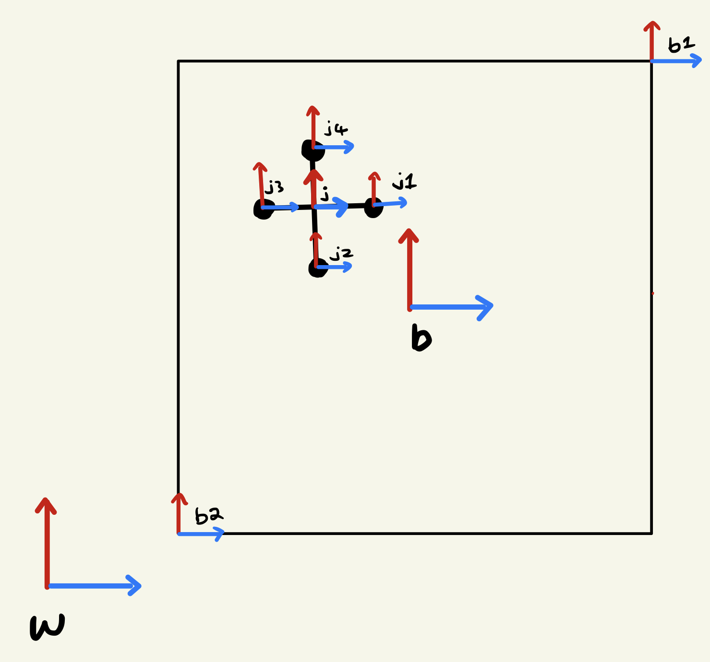
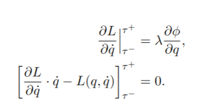

# ME-314 Final Project (Jack in a box)
This is the final project of ME314 "machine dynamics" at Northwestern University, done by Jiasen Zheng.

## Brief overview
This project aims to simulate a planer multi-body dynamics of a jack in a box. In the simulation, external forces are applied to the box. While the jack is falling freely, it will then experience some collisions with the box's walls.

## System schematic

In the figure shown above, the system is a planar model, which means the two objects can only move in x and y directions. There are 9 frames in total:
* **w:** the world frame (reference frame)
* **b:** the box frame at the center of the box
* **j:** the jack frame at the center of the box
* **b1,b2**: the frames of the two corners of the box
* **j1,j2,j3,j4:** the frames of the 4 masses of the jack

## Parameter setups
* **l_box(5):** perpendicular distance from the center of the box to each wall
* **m_box(150):** mass of each wall
* **l_jack(1):** distance between the center of the jack to the mass attached to it
* **m_jack(5):** point mass of each mass attached to the jack
* External force: only a force in the positive y-direction is set to counter the gravitational force from the box
* Initial configuration: A initial rotational speed of the box is set to be 1.5 rad/s so that the box keeps spinning counter-clockwise in the simulation

## Algorithm descriptions
* Rigid body transform 
    * **g_wb & g_wj:** Transformations from the world frame to the box/ jack frame
    * **g_bb1 & g_bb2:** Transformations from the box frame to its two corners
    * **g_jj1 ~ g_jj4:** Transformations from the jack frame to its for masses
    * **g_b1j1 ~ g_b1j4:** Transformations from the top right corner to each mass of the jack
    * **g_b2j1 ~ g_b2j4:** Transformations from the bottom left corner to each mass of the jack
* Euler Lagrange</br></br>
To solve for the dynamic motions of the system, we need to calculate the Euler Lagrange equations and the external force and then equate them. Since we are dealing with objects with rotational inertia, we need to calculate the rotational kinetic energy. The following steps are used to find Euler Lagrange equations:
    1. Calculate body velocities of each object
    2. Find the 6 by 6 mass inertias of both objects. Both the jack and the mass are simplified as a model with 4 point masses attached to them
    3. Calculate the kinetic and potential energies for both objects
    4. Compute the Lagrangian of the system (L = KE-V)
    5. Find the Euler Lagrangian equation based on Lagrangian (E_L = ddLdqdot - dLdq)

* External forces</br></br>
The only external force in this project is the force in the positive y-direction. The force is set to be the same as the gravitational force of the box. As a result, the whole system can be balanced and stay in the center of the frame in the simulation.

* Constraint equations</br></br>
The constraints are determined between each mass of the jack and each wall of the box so that there are in total 16 constraints defined. The constrain variable phi is defined as the expression of the distance between the two impact object. For example, the phi value between mass 1 of the jack and the right wall of the box is the x value of g_b1j1 (g_b1j1[0,3])

* Impact updates</br></br>
The following steps are used to solve for impact updates:
    1. Create dummy variables for all my configurations variable for both before and after impact
    2. Calculate Hamiltonian, dLdqdot, dphidq for the system
    3. Substitute dummy variables to those equations for both before and after impact
    4. Construct and solve for the equations based on the following formula:</br>
    


## User instruction
* Jupyter notebook is needed to run the script
* In a terminal, run:
```shell
jupyter notebook
```
* In the notebook, under `Kernel` menu, select `Restart & Run All`
